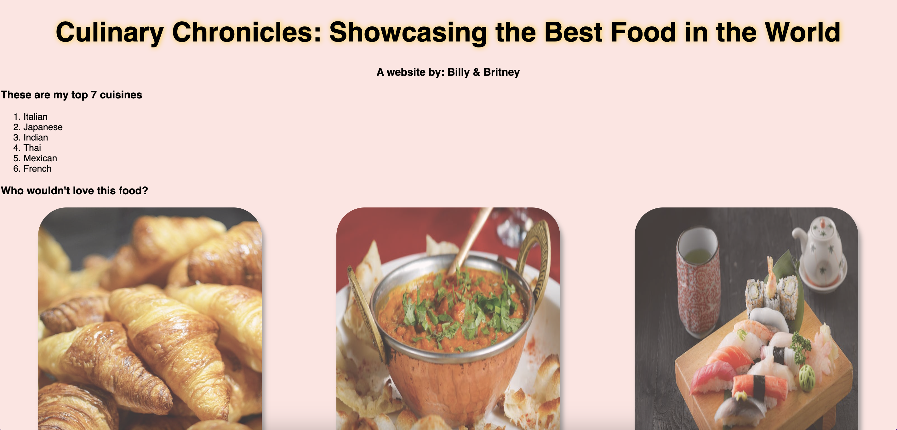

# Culinary Chronicles 👨‍🍳

**GOAL**: Create a webpage that showcases you and your partners favorite cuisines, dishes, and recipes. 

Create an `index.html` file that contains:
- A list of your favorite cuisines and pictures
- A list of your favorite dishes with pictures
- A list of recipes with links to sites that provide the recipe
- Wrap each of the above lists in `div` elements with class and id attributes.

Additionally, you will style this page to ensure that it entices users to read and utilize your webpage. Your `style.css` should incorporate the following design elements:
- Create a `style.css` file
- Link the file to `index.html` using a `<link>` tag.
- Create CSS rulesets that incorporate the following CSS properties to style the elements on the page. **Make sure you use element, class, and id selectors**:
    - `color`
    - `background-color`
    - `font`
    - `font-size`
    - `text-decoration`
    - `text-align`
    - `text-shadow`
    - `box-shadow`
- Additionally, style your images using the following properties:
    - `width`
    - `border-radius`
    - `opacity`

**Done Early?** Try the following stretch exercises 🚀
- Align your images in the center of the page
- Give your images a border
- Give your page a background image
- Create a navigation bar at the top of your page. Style this navigation bar using CSS.
- Check out pseudo-elements like `::before` and `::after` to try to animate your links.